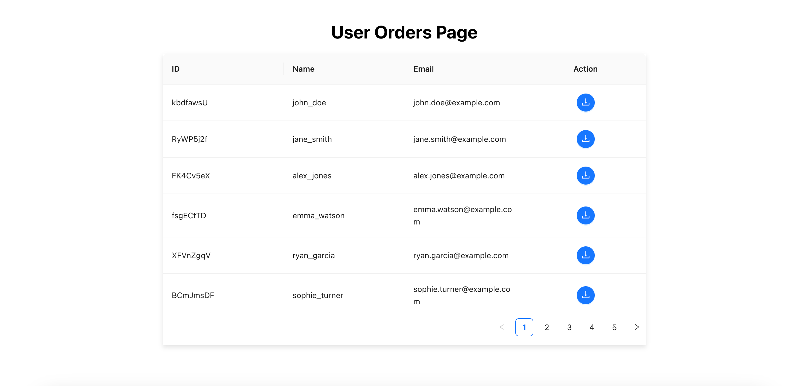

## Users Orders Page

- `npm install` to install the packages
- `npm start` to start the server
- Instead `docker-compose build` and `docker-compose up` will bring the service up and running

#### Once up this is how it will look like

